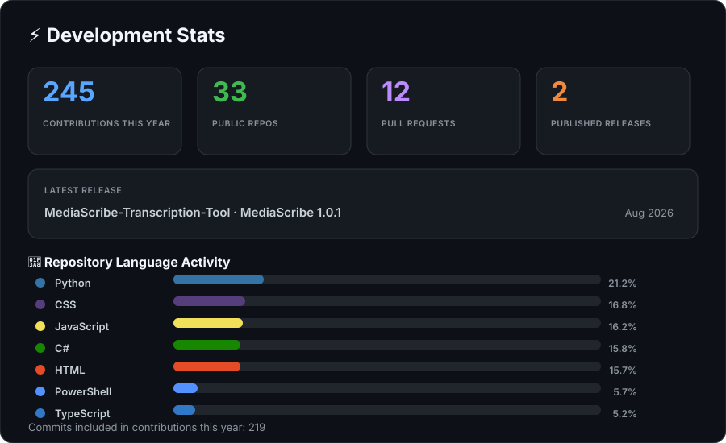

# Hi there 👋 I'm Eric

I'm currently pursuing a **Bachelor's degree in Computer Programming and Web Design at BYU-Idaho** while building software projects focused on performance, usability, automation, and real-world problem solving.

My background spans **television broadcast engineering & production, IT/networking/infrastructure, facilities troubleshooting, and software development**. I enjoy projects that combine clean UI/UX, practical engineering, system-level thinking, performance analysis, and useful automation.

---

## 🚀 Featured Projects

### 🎙️ MediaScribe
A local Windows transcription application built with **PowerShell, Python, OpenAI Whisper, and FFmpeg**.

- GUI and terminal workflows
- Batch transcription
- Language detection and English translation
- Caption/subtitle output
- Safe stop and file-protection behavior
- Self-contained dependency handling

**Current public release:** MediaScribe 1.0.1  
[View MediaScribe](https://github.com/e-arndt/MediaScribe-Transcription-Tool)

### 🌎 Projecto Honduras
A modern nonprofit web platform with public content, program information, galleries, events, authentication, and an administrative dashboard.

Built around **TypeScript, Next.js, PostgreSQL, and modern cloud deployment workflows**.

### ⏱️ Time Complexity Analyzer
A **Node.js + TypeScript** benchmarking application for comparing algorithm performance and analyzing execution times across different datasets.

[View project](https://github.com/e-arndt/CSE310-TimeComplexityAnalyzer)

### 🔐 Rust Password Security Demonstrator
An educational **Rust** CLI project demonstrating deterministic brute-force search, password hashing concepts, and the importance of password complexity.

[View project](https://github.com/e-arndt/CSE-310-Rust-Password-Demonstrator)

---

## 🛠️ Languages & Tools

  

---

## ⚡ Development Stats

  

---

## 🎯 Current Focus

- Rust development
- TypeScript / Node.js
- Full-stack web applications
- Software testing & automation
- UI/UX design
- Database-driven applications
- Secure authentication systems
- System architecture & networking
- Local AI and transcription workflows

---

## 🔧 Engineering Interests

- Broadcast engineering
- System design
- Networking & VLAN architecture
- Embedded systems
- Performance optimization
- Human-centered UI design
- Retro-futuristic interfaces

---

## 🌱 Currently Learning

- Advanced Rust concepts
- Concurrent programming
- Frontend application architecture
- Secure authentication systems
- AI-assisted development workflows

---

> “Good engineering is often invisible when it works correctly.”
